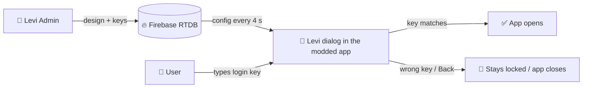

<div align="center">



[](https://github.com)


**[⬇ Download](#-download) · [🚀 Quick start](#-quick-start) · [🎨 Editor](#-what-you-can-design) · [🧩 Mod it](#-put-the-dialog-in-an-apk-mt-manager) · [🛠 Build](#-build-it-yourself) · [❓ Help](#-troubleshooting)**

</div>

---

## ✨ What is Levi?

Two small, pure-native Java apps that work together:

| | **Levi** (dialog) | **Levi Admin** (panel) |
|---|---|---|
| **Role** | The login-key dialog that locks an app until the user types the right key | Your control room: create apps, keys, and design the dialog live |
| **Package** | `com.levi.dialog` | `com.levi.admin` |
| **Files** | `MainActivity.java` + `Levi.java` | `MainActivity`, `Editor`, `UI`, `Compressor` + a copy of `Levi.java` for the live preview |
| **Talks to** | Firebase Realtime Database (REST, no SDK) | Firebase Realtime Database (REST, no SDK) |
| **Extra** | Exactly **one** `classes.dex` | Glass UI, aurora glow, floating nav |



---

## ⬇ Download

> Grab the APKs from the **[Releases](../../releases/latest)** page → **Assets**.

| File | What it is |
|---|---|
| `Levi-vX.Y.Z.apk` | The dialog app (single `classes.dex`) – open it in MT Manager and edit `Levi.smali` |
| `Levi-Admin-vX.Y.Z.apk` | The admin panel – install on your phone |

Both APKs are built by GitHub Actions and signed with the debug key (fine for modding/testing).

---

## 🚀 Quick start

<details open>
<summary><b>1 · Firebase (2 minutes)</b></summary>

1. [Firebase console](https://console.firebase.google.com) → create a project → **Build → Realtime Database → Create database**.
2. Copy the **databaseURL** shown at the top (looks like `https://xxxx-default-rtdb.firebaseio.com`).
3. Open the **Rules** tab, paste this and press **Publish**:

```json
{
  "rules": {
    ".read": false,
    ".write": false,
    "levi_apps":  { ".read": true, ".write": true },
    "levi_media": { ".read": true, ".write": true },
    "levi_admin": { ".read": true, ".write": true }
  }
}
```
</details>

<details open>
<summary><b>2 · Levi Admin</b></summary>

1. Install **Levi Admin**, paste the databaseURL → **Connect**.
2. First run: **create your admin key** (tap the 👁 eye to see it, or press *Generate strong key*). Next time you enter the same key.
3. Tap the **+** button → give *app name*, *short detail*, an *icon* (gallery or URL). The date is automatic.
4. Open the app card. You get:
   - **App Connect Key** `LV-XXX-XXX-ST` (unique per app)
   - **Login Key** `LEVI-XXX-XXX-ST` (what your user types)
   - **Firebase databaseURL**
   - **INTERNET permission line** – one-tap copy
   - **Dialog Show** switch, **Edit**, **Delete** and extras
5. Turn **Dialog Show** on. Tap **Edit** to design the dialog.
</details>

<details open>
<summary><b>3 · Give the keys to the dialog</b></summary>

Continue with **[Put the dialog in an APK](#-put-the-dialog-in-an-apk-mt-manager)**.
</details>

---

## 🧩 Put the dialog in an APK (MT Manager)

The **Levi** APK has a single `classes.dex`. The two placeholders are the **first fields at the top** of `Levi.smali`.

1. MT Manager → open `Levi.apk` → tap **classes.dex** → **Levi.smali** (`com/levi/dialog/Levi.smali`).
2. At the top of the file replace the text inside the quotes:

| Field | Placeholder | Replace with |
|---|---|---|
| `APP_ACCESS_KEY` | `LV-XXX-XXX-ST` | the **App Connect Key** from Levi Admin |
| `FIREBASE_DATABASE_URL` | `https://YOUR-PROJECT-default-rtdb.firebaseio.com` | your Firebase **databaseURL** |

3. Save → **Sign** → install. Done.

**Using it on another app?** Copy `Levi.smali` (and the `Levi$*.smali` files) + `assets/fonts` into the target APK and add this line at the end of its main Activity `onCreate`:

```smali
invoke-static {p0}, Lcom/levi/dialog/Levi;->show(Landroid/app/Activity;)V
```

> The target app must also have `<uses-permission android:name="android.permission.INTERNET"/>` (copy it from the app page in Levi Admin).

### How the dialog behaves

- 🔒 **Modal** – shows over every screen of the app, survives rotation, until the key is verified.
- ✅ **Verified once** – remembered on the device. Regenerate the Login Key in the admin to make everyone verify again.
- 🔁 **Live** – while visible it re-checks Firebase every ~4 s, so your edits appear without restarting the app.
- 🚪 **Back = exit** – pressing Back closes the app. (Optional ✕ exit chip in the editor.)
- 🚫 **Dialog Show off** – the app opens normally.
- 📴 Offline / wrong keys → shake + toast, stays locked.

---

## 🎨 What you can design

Open an app → **Edit**. The **live preview** on top updates as you move sliders.

<details>
<summary><b>🖼 Media</b></summary>

- Background: **Gradient / Image / Video** – by URL or from the gallery
- Banner: **Image / Video** (portrait video supported, centre-cropped)
- Recommended sizes are shown in the editor (banner ≈ 1000 × 486, background 1080 × 1080)
- Gallery images are shrunk automatically
- **Gallery videos above your limit are auto-compressed** (default 5 MB, set 2–6 MB in *Settings → Video*)
</details>

<details>
<summary><b>🌈 Gradients & background effects</b></summary>

- **30 gradient presets** (incl. *Levi Violet* and *Levi Glow* taken from the Levi icon)
- Custom 2-colour gradient + angle
- **Colours from a gallery image** or from your current background image
- Noise / grain, blur
- **21 background animations:** Gradient spin · Pulse glow · Slow zoom · Drift X · Drift Y · Sway · Shimmer · Aurora · Bokeh · Stripes · Breathe · Waves · Sparkle · Rain · Vignette pulse · Hue cycle · Spotlight · Grid scan · Snow · **Color flow**
- Choosing a gradient turns **Color flow** on automatically
</details>

<details>
<summary><b>🔤 Text & fonts</b></summary>

- Title, description (shown on the banner), input hint, button texts, **Get Key URL**
- Fonts per category (title / description / input / buttons) – **20 bundled fonts** in `assets/fonts`:
  League Gothic, Bebas Neue, Anton, Oswald, Pacifico, Lobster, Dancing Script, Caveat, Bangers, Righteous, Orbitron, Audiowide, Press Start 2P, Cinzel, Abril Fatface, Playfair Display, Russo One, Monoton, Creepster, Bungee
</details>

<details>
<summary><b>🎛 Colours & shape</b></summary>

- Per-category colours with **hex + alpha picker + presets**: title, description, input fill/border/text, button fill/border/text, dialog border
- 6 one-tap themes: Light glass · Midnight · Sunset · Mint · Neon · Mono
- Dialog **width, height, corner radius (up to a perfect circle)**, border
- Title / description / input text size, input & button roundness, button size, button border
- Dim amount behind the dialog
</details>

<details>
<summary><b>🎬 Entrance animations (20)</b></summary>

None · Fade · Scale up · Slide up · Slide down · Slide left · Slide right · Zoom out · Bounce · Flip X · Flip Y · Rotate in · Elastic pop · Drop · Swing · Soft focus · Spin zoom · Slide + tilt · Pulse in · Tada

Master **animations on/off** switch + duration slider.
</details>

---

## 🛰 Levi Admin highlights

| | |
|---|---|
| 🪟 **Glass UI** | Green & white glass cards, moving aurora glow, floating pill navigation |
| 📊 **Dashboard** | Total apps, dialogs ON/OFF, live database latency, recent apps |
| 🔎 **Apps** | Search, tap an app for keys/permission/switches |
| 🧰 **Extras** | Regenerate Login Key · Duplicate app · Copy-all bundle · Export / import config JSON |
| ⚙ **Settings** | Dark mode · animations · aurora · 5 accent colours · UI font · glass intensity · video compression · stay signed in · change admin key · lock · disconnect |
| 📖 **Guide** | Built-in step-by-step help with a copy button for the Firebase rules |

---

## 🗄 Data layout

```
levi_admin/hash                     SHA-256 of the admin key
levi_apps/<ConnectKey>/
    name, desc, date, icon, loginKey, enabled, created
    cfg { title, bgType, bgSrc, grad, bgFx, enter, ... }   dialog design
levi_media/<ConnectKey>/bg|banner   uploaded gallery media (data URLs)
```

> 🔐 **Security note:** the login key is checked on the device and the database paths above are open, so this is a **gate for mods**, not strong protection. For more security use Firebase Auth and tighter rules.

---

## 🛠 Build it yourself

```
Levi/                      dialog app
LeviAdmin/                 admin app
assets/banner.svg          README banner
.github/workflows/build.yml
RELEASE_NOTES.md           text for the GitHub release
```

1. Create a GitHub repo and push everything (keep the `.github` folder).
2. **Actions** → *Build Levi + Levi Admin* → download the artifacts **Levi** and **Levi-Admin**.
3. The workflow also fails if the Levi APK ever has more than one `classes.dex`.

### 📦 Publish a release (APKs as downloadable assets)

```bash
git tag v1.1.0
git push origin v1.1.0
```

The workflow builds both apps and creates a **GitHub Release** with `Levi-v1.1.0.apk` and `Levi-Admin-v1.1.0.apk` attached, using `RELEASE_NOTES.md` as the description. You can also create the release by hand and paste the notes.

### 🖼 Change the icon

Replace `ic_launcher.png` and `ic_launcher_round.png` in each `res/mipmap-*` folder (both apps).

---

## ❓ Troubleshooting

| Problem | Fix |
|---|---|
| *Permission denied* when connecting | Publish the Firebase rules above |
| Dialog never shows | **Dialog Show** is off, or the App Connect Key / databaseURL in `Levi.smali` is wrong |
| "Invalid app connect key" toast | The key doesn't exist in this database – copy it again from the app page |
| Dialog shows no custom design | Press **Save** in the editor; check internet + the INTERNET permission |
| Gallery video won't upload | Keep it under 6 MB (auto-compress does this) or paste a URL |
| Fonts look default | `assets/fonts` must be inside the APK that shows the dialog |
| Users must re-verify | You regenerated the Login Key (expected) |

---

<div align="center">

Made with 💚 by **TENIx**


</div>
